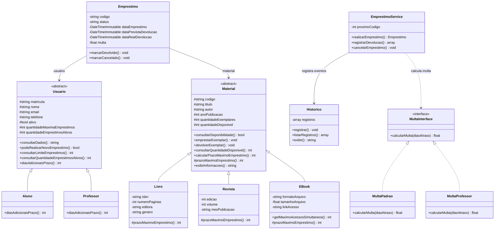

# Diagrama de Classes UML

O diagrama abaixo usa Mermaid. Se o visualizador não renderizar Mermaid, cole o conteúdo em um editor compatível, como Mermaid Live Editor.

```mermaid
classDiagram
    class Material {
        <<abstract>>
        #string codigo
        #string titulo
        #string autor
        #int anoPublicacao
        #int quantidadeExemplares
        #int quantidadeDisponivel
        +consultarDisponibilidade() bool
        +emprestarExemplar() void
        +devolverExemplar() void
        +consultarQuantidadeDisponivel() int
        +calcularPrazoMaximoEmprestimo() int
        #prazoMaximoEmprestimo()* int
        +exibirInformacoes() string
    }
    class Livro {
        -string isbn
        -int numeroPaginas
        -string editora
        -string genero
        #prazoMaximoEmprestimo() int
    }
    class Revista {
        -int edicao
        -int volume
        -string mesPublicacao
        #prazoMaximoEmprestimo() int
    }
    class EBook {
        -string formatoArquivo
        -float tamanhoArquivo
        -string linkAcesso
        +getMaximoAcessosSimultaneos() int
        #prazoMaximoEmprestimo() int
    }
    class Usuario {
        <<abstract>>
        #string matricula
        #string nome
        #string email
        #string telefone
        #bool ativo
        #int quantidadeMaximaEmprestimos
        #int quantidadeEmprestimosAtivos
        +consultarDados() string
        +podeRealizarNovoEmprestimo() bool
        +consultarLimiteEmprestimos() int
        +consultarQuantidadeEmprestimosAtivos() int
        +diasAdicionaisPrazo()* int
    }
    class Aluno {
        +diasAdicionaisPrazo() int
    }
    class Professor {
        +diasAdicionaisPrazo() int
    }
    class Emprestimo {
        -string codigo
        -string status
        -DateTimeImmutable dataEmprestimo
        -DateTimeImmutable dataPrevistaDevolucao
        -DateTimeImmutable dataRealDevolucao
        -float multa
        +marcarDevolvido() void
        +marcarCancelado() void
    }
    class Historico {
        -array registros
        +registrar() void
        +listarRegistros() array
        +exibir() string
    }
    class EmprestimoService {
        -int proximoCodigo
        +realizarEmprestimo() Emprestimo
        +registrarDevolucao() array
        +cancelarEmprestimo() void
    }
    class MultaInterface {
        <<interface>>
        +calcularMulta(diasAtraso) float
    }
    class MultaPadrao {
        +calcularMulta(diasAtraso) float
    }
    class MultaProfessor {
        +calcularMulta(diasAtraso) float
    }

    Material <|-- Livro
    Material <|-- Revista
    Material <|-- EBook
    Usuario <|-- Aluno
    Usuario <|-- Professor
    MultaInterface <|.. MultaPadrao
    MultaInterface <|.. MultaProfessor
    Emprestimo --> Usuario : usuário
    Emprestimo --> Material : material
    EmprestimoService --> Historico : registra eventos
    EmprestimoService ..> MultaInterface : calcula multa
```
